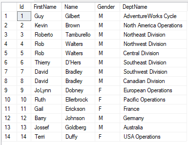
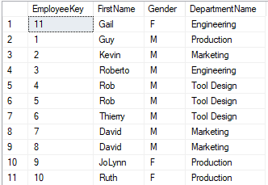
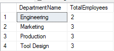
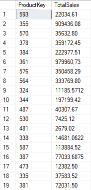
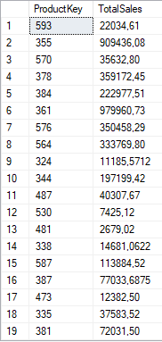

Table funktsionid

Scalar Funktsionid

Temporary tables

**fn_ILTVF_GetEmployees()**

**fn_MSTVF_GetEmployees();**

**fn_GetEmployee_NameById()**

VWEmployeesByDepartment

vWITDepartment_Employees

vWEmployeesNonConfidentialData

vWEmployeesCountByDepartment

